# design-token-gate

Every shipped screen draws its colors, type sizes, corners, and shadows from one tokens file, or the build fails. design-token-gate reads the ladders from your tokens.css, scans the source for hand-typed values that should have been a token, and holds a frozen list of old debt that can only shrink. Node 18+, no dependencies.




## Install

Install the command:

```bash
npm install --global github:eliferres/design-token-gate
```

Or run it without installing anything:

```bash
npx github:eliferres/design-token-gate --tokens src/tokens.css --scope src --baseline design-token-baseline.json
```

Either way the installed command is `design-token-gate`, and
`design-token-gate --version` prints the version. The tool is not published
to the npm registry; both forms install straight from the GitHub repo.

To run the demo below, clone the repo instead:

```bash
git clone https://github.com/eliferres/design-token-gate.git
cd design-token-gate
node design-token-gate.mjs --tokens demo/tokens.css --scope demo/src --baseline demo/baseline.json
node design-token-gate.mjs --tokens demo/tokens.css --scope demo/clean-src --baseline demo/baseline.json
```

Zero dependencies, Node 18+, no network needed for the demo. `demo/tokens.css`
holds six tokens: two colors, two font sizes, one radius, one shadow.
`demo/src/card.css` hardcodes three of those values by hand and gets one
radius wrong; `demo/clean-src/card.css` is the same rule written with
`var()`.

## Walkthrough

Run the gate against the hand-typed file:

```bash
node design-token-gate.mjs --tokens demo/tokens.css --scope demo/src --baseline demo/baseline.json
```

```text
design-token-gate: 3 violation(s) - demo/tokens.css owns the tokens and ladders:
  src/card.css:2 raw #1a1a2e -> use var(--color-ink)
  src/card.css:5 off-ladder border-radius 6px -> use var(--radius-card) (ladder: 8)
  src/card.css:4 raw shadow color -> use var(--shadow-card)

Grandfathered debt is frozen in baseline.json - that list only shrinks.
```

Exit code 1. The font-size in that same file is a hand-typed `14px`, but it
is not reported: it happens to sit exactly on the font-size ladder, so the
gate has nothing to correct even though the honest fix is still `var()`.
Rule 2 only refuses a value once it falls off the ladder.

Now run it against the file written with tokens:

```bash
node design-token-gate.mjs --tokens demo/tokens.css --scope demo/clean-src --baseline demo/baseline.json
```

```text
design-token-gate: clean - every token value flows from demo/tokens.css (0 grandfathered violation(s) still owed).
```

Exit code 0.

## Spacing, borders, durations and breakpoints

Four more ladders switch on when your tokens file declares them, read by
the same naming rule as the font-size and radius ladders:

| Ladder | Token names containing | Checked in |
| --- | --- | --- |
| spacing | `space`, `spacing`, `gap`, `gutter` (never `letter-spacing` or `word-spacing`) | `margin`, `padding`, `gap`, `row-gap`, `column-gap` and their side and logical longhands; inline `padding`, `margin`, `gap` and their longhands, as a number or a string of several values |
| border | `border`, `stroke`, `outline` (never with `radius` or `corner`) | `border` and its side and logical forms with or without `-width`, `outline`, `outline-width`, `outline-offset`; inline `borderWidth` and its side and logical forms, `outlineWidth`, `outlineOffset` |
| duration | `duration`, `delay` | `transition`, `animation` and their `-duration` and `-delay` longhands, `ms` and `s` compared in milliseconds |
| breakpoint | `breakpoint`, `screen`, `bp-` | the widths inside `@media` queries |

```text
design-token-gate: optional ladders: spacing on; breakpoint on
...
src/card.css:1 off-scale padding 13px -> use var(--space-4) (spacing scale: 4/8/16px)
src/card.css:2 off-scale breakpoint 900px -> nearest token --breakpoint-lg (breakpoint scale: 768/1024px)
```

Zero passes in any unit, and a negative margin is read as its size, so
`-8px` is the 8px step. A media query cannot read a custom property, so
a breakpoint token is honored by typing its value; the gate checks that
the typed width is one of them, and accepts a `max-width` one step under
a breakpoint (`767px` or `767.98px` under a 768px token), the usual way
to end a range without overlapping the next one.

Every run that finds any of these tokens names the optional ladders on
its first line, for example `optional ladders: spacing on; breakpoint on`,
and says `off` for one whose tokens are written in a unit it does not
read. These four are optional where font-size and radius are not. Many token
systems stop at color and type, and a tokens file with no spacing tokens
gets no spacing check rather than a refusal to run. Their findings join
the same baseline, keyed by property and value (`"padding:13px"`).

## Accepting one value on purpose

Some hand-typed values are right: the frame of a third-party widget, a
print stylesheet, an email template that cannot load your tokens. Put a
`token-vouch` comment with a reason on the same line:

```css
.embed { padding: 13px; } /* token-vouch: matches the payment widget's own frame */
```

The value passes, and the report says so with the reason attached:

```text
design-token-gate: optional ladders: spacing on; breakpoint on
design-token-gate: 1 hand-typed value(s) vouched for:
  vouched: src/embed.css:1 off-scale padding 13px -> use var(--space-4) (spacing scale: 4/8/16px) - matches the payment widget's own frame
design-token-gate: clean - every token value flows from src/tokens.css (0 grandfathered violation(s) still owed, 1 hand-typed value(s) vouched for).
```

A vouch covers every value on its own line and nothing on the next, so
keep one declaration per line where you use it. A vouch with no reason
vouches for nothing, and the violation says why. Vouched values never
enter the baseline: an exception you wrote down on purpose is not debt.
In a script file the comment is `// token-vouch: <reason>`.

## Skipping whole files

A token specimen page prints your tokens as raw values on purpose, and a
vendored embed is not yours to fix. Skip them by glob, as many times as
you need:

```bash
node design-token-gate.mjs --tokens src/tokens.css --scope src --baseline design-token-baseline.json \
  --allow-file "specimens/**" --allow-file print.css
```

A glob with a slash is matched against the path under `--scope`, where
`*` stays inside one directory, `**` crosses directories and `?` is one
character. A glob without a slash is matched against the file name alone,
at any depth, so `print.css` skips every file of that name and `*.css`
would skip every stylesheet. The report counts the skipped files, a
pattern that matches nothing is named on stderr, and patterns that leave
nothing to scan stop the run with exit 2 rather than pass it.

## Wiring it into CI

```json
{
  "scripts": {
    "design-tokens": "node design-token-gate.mjs --tokens src/tokens.css --scope src --baseline design-token-baseline.json"
  }
}
```

```yaml
- name: Design tokens
  run: npm run design-tokens
```

Any exit code other than 0 fails the step, so a hand-typed value in a pull
request blocks the merge the same way a failing test would. The two
non-zero codes are worth telling apart in a script: 1 means the gate ran
and found drift, 2 means the gate could not run at all (a missing tokens
file or scope directory, an unknown flag, a missing baseline). A step that
inverts the command and accepts any non-zero code reads a typo in a path
as a caught violation; check for exit 1 on purpose instead.

## How the baseline works

A codebase that already hardcodes hundreds of values cannot switch this
gate on cold: the first run would fail everywhere, and a gate that fails
everywhere gets deleted, not fixed. Point `--baseline` at a JSON file and
run with `--freeze` once, before the gate is wired into CI:

```bash
node design-token-gate.mjs --tokens src/tokens.css --scope src --baseline design-token-baseline.json --freeze
```

That writes a file keyed by source file, then by the offending value, then
by how many times it occurs. Both rules feed the same baseline: a rule 2
ladder miss is keyed by its value (`"font-size:13px"`), and a rule 1 raw
hex is keyed by the hex string itself (`"#1a1a2e"`) - a codebase that
hardcodes a token's color a hundred times is exactly as much pre-existing
debt as one that hand-types a hundred off-ladder font sizes, and only
freezing one of the two rules is how a legacy tree "passes" the gate right
up until CI is wired and it fails on day one. Line numbers are never part
of either key, so moving a declaration to another line does not fail the
build, but adding a new one does. From then on the gate passes anything at
or under the frozen count and refuses anything above it. Fix a violation
and the count naturally drops; run `--freeze` again to lower the ceiling
to match. Raising a count needs a deliberate `--freeze --allow-increase`,
which is the shape of change a reviewer should ask about in a diff.

## Limitations

- Static analysis only, over CSS files and object literals in
  JS/TS/JSX/TSX. In a script the gate reads any object key named like a
  style property (`fontSize`, `padding`, `borderWidth`), so a non-style
  object such as a chart config with `padding: 13` is read too; vouch for
  that line or skip the file with `--allow-file`. Nothing is rendered, no
  computed styles, no CSS-in-JS template literals, no Sass or Less
  variables.
- The walker never descends into `node_modules`, `.git`, `dist`, `build`,
  `coverage`, or `.next`, so pointing `--scope` at a project root grades
  your source and not your dependencies or your build output. That list is
  fixed and there is no flag to change it.
- Which custom properties feed which ladder is decided by the property
  name in your tokens file: `text` or `font` for the font-size ladder,
  `radius` or `corner` for the radius ladder, `shadow` or `elev` for shadow
  tokens, and the names in the table above for the four optional
  ladders. A tokens file that names things differently needs no code
  change, just token names the gate can read. Each run names the
  optional ladders it found, on or off: a spacing scale written in `rem`
  prints `spacing off (its tokens are not in px)`. A ladder whose token
  names are missing altogether, a typo included, is not mentioned.
- The radius and font-size rules flag values that fall *off* the ladder,
  not every hand-typed value that happens to match one on it. A `14px`
  that equals an existing token is still not a `var()`, and this gate will
  not tell you that.
- Lengths are compared in `px` only. A `1.5rem` padding or an `em`
  breakpoint is not read, and neither is a duration or a media query
  written in JavaScript (`matchMedia`, an animation library's options).
- The hex rule matches six-digit hex colors only, and only the exact value
  of an existing token. `rgb()`, `hsl()`, three-digit hex, and colors that
  are close but not identical to a token all pass silently.

## Why

This came out of an internal app where a growing token system kept
getting bypassed by hand-typed values that slipped past code review: a
hex that matched a color token, a font size one pixel off the type scale,
a shadow copied from a previous component instead of the shared elevation
token. A hex-only lint caught the first kind and missed the other two for
months, until a design review found all three on one shipped screen at
once. This is the generalized, standalone version of the gate that came
out of fixing that: no company names, no fixed directory layout, just a
tokens file and a directory to scan.

MIT licensed. See LICENSE.
